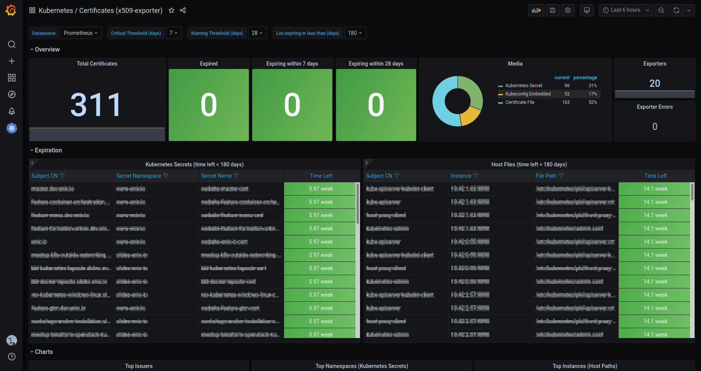

# 🔏 X.509 Certificate Exporter

[](https://goreportcard.com/report/github.com/enix/sandbox-x509-certificate-exporter)
[](https://securityscorecards.dev/viewer/?uri=github.com/enix/sandbox-x509-certificate-exporter)
[](https://opensource.org/licenses/MIT)
[](https://enix.io)

A Prometheus exporter for X.509 certificates, built **for Kubernetes first**.
It watches your cluster's TLS material as native Kubernetes resources —
Secrets, ConfigMaps, kubeconfigs, on-disk PKI on the nodes — and turns
expirations into actionable Prometheus series. Designed to run inside the
cluster it observes, but equally happy as a standalone binary.



## What it watches

- **TLS Secrets** of any type — `kubernetes.io/tls`, opaque PEM bundles,
  full chains — across all namespaces or a curated subset.
- **ConfigMaps** holding PEM material (`ca.crt`, custom keys).
- **PKCS#12** keystores and truststores, with passphrase pulled from a
  sibling key in the same Secret, an external file, or none
  (`tryEmptyPassphrase`).
- **Files and directories** on cluster nodes (kubelet, etcd, kube-apiserver
  PKI), via a node-local DaemonSet.
- **Kubeconfigs** with embedded base64 certificates or PEM file references.

## Highlights of v4

- **YAML configuration** instead of CLI flags. A single source of truth, easy
  to ship as a ConfigMap, easy to validate.
- **Native ConfigMap support** alongside Secrets.
- **Server-side filtering** with label selectors and namespace
  include/exclude rules — both by name and by namespace label — so the
  informers only see what they need.
- **First-class observability**: `/healthz`, `/readyz`, per-source
  `x509_source_up` / `x509_source_bundles` / `x509_source_errors_total`,
  scrape & parse latency histograms, panic counter.
- **Prometheus exporter-toolkit** integration for native TLS / BasicAuth
  on the metrics endpoint (no more `kube-rbac-proxy` sidecar required).
- **Multi-arch container images** (`amd64`, `arm64`, `riscv64`) in two
  flavors: `busybox` (default) and `scratch`.

## 📦 Install on Kubernetes

The [Helm chart](./chart) is the primary way to deploy on Kubernetes:

```sh
helm repo add enix https://charts.enix.io
helm install x509-certificate-exporter enix/sandbox-x509-certificate-exporter
```

For configuration, fixtures, and node-PKI DaemonSets, head to the
[**chart README**](./chart) — that's where the day-to-day operational
documentation lives.

## 🔀 Other ways to run it

- **OCI** container images on
  [Docker Hub](https://hub.docker.com/r/enix/sandbox-x509-certificate-exporter),
  [GHCR](https://github.com/enix/sandbox-x509-certificate-exporter/pkgs/container/x509-certificate-exporter)
  and [Quay](https://quay.io/repository/enix/sandbox-x509-certificate-exporter).
- **Pre-built binaries** for Linux/macOS/Windows on every
  [release](https://github.com/enix/sandbox-x509-certificate-exporter/releases).
- **Building from source**:

  ```sh
  go build ./cmd/x509-certificate-exporter
  # or, for a reproducible release-grade local snapshot:
  task image          # GoReleaser snapshot — no push, no sign
  ```

The binary is configured by a single YAML file passed via `--config`. See
[`dev/values.yaml`](./dev/values.yaml) for an exhaustive example covering
every source kind.

## 🔐 Verifying authenticity

Every tagged release is signed and attested by the
[release workflow](./.github/workflows/release.yaml) running on GitHub
Actions. Consumers can verify what they pull before trusting it.

**Container images** are signed keyless via [sigstore/cosign](https://docs.sigstore.dev/cosign/overview/)
(GitHub OIDC → Fulcio cert → Rekor transparency log) and ship with a
[CycloneDX](https://cyclonedx.org) SBOM attached as a cosign attestation:

```sh
# Verify the signature
cosign verify ghcr.io/enix/sandbox-x509-certificate-exporter:4.0.0 \
  --certificate-identity-regexp '^https://github\.com/enix/sandbox-x509-certificate-exporter/' \
  --certificate-oidc-issuer https://token.actions.githubusercontent.com

# Inspect the SBOM
cosign verify-attestation ghcr.io/enix/sandbox-x509-certificate-exporter:4.0.0 \
  --type cyclonedx \
  --certificate-identity-regexp '^https://github\.com/enix/sandbox-x509-certificate-exporter/' \
  --certificate-oidc-issuer https://token.actions.githubusercontent.com \
  | jq -r '.payload | @base64d | fromjson | .predicate'
```

The same commands work against `quay.io/enix/...` and `enix/...` (Docker Hub).

**Binary releases** ship with a [SLSA Level 3](https://slsa.dev/spec/v1.0/levels#build-l3)
provenance attestation (`x509-certificate-exporter.intoto.jsonl` on the
GitHub Release). Verify with [`slsa-verifier`](https://github.com/slsa-framework/slsa-verifier):

```sh
slsa-verifier verify-artifact x509-certificate-exporter-v4.0.0-linux-amd64.tar.gz \
  --provenance-path x509-certificate-exporter.intoto.jsonl \
  --source-uri github.com/enix/sandbox-x509-certificate-exporter \
  --source-tag v4.0.0
```

Binary checksums are also published as `checksums.txt` alongside each release.

**The Helm chart** is also published as a signed OCI artifact:

```sh
# Pull, then verify the signature on the chart's OCI ref
helm pull oci://quay.io/enix/charts/x509-certificate-exporter --version 4.0.0
cosign verify quay.io/enix/charts/x509-certificate-exporter:4.0.0 \
  --certificate-identity-regexp '^https://github\.com/enix/sandbox-x509-certificate-exporter/' \
  --certificate-oidc-issuer https://token.actions.githubusercontent.com
```

## 📊 Metrics

Per-certificate (one series per cert, labels include `subject_CN`,
`issuer_CN`, `serial_number`, source-specific `secret_*` / `configmap_*` /
`filepath`, optional surfaced Secret labels):

| Metric | Type | Notes |
|---|---|---|
| `x509_cert_not_before` | gauge | Unix timestamp |
| `x509_cert_not_after` | gauge | Unix timestamp |
| `x509_cert_expired` | gauge | `1` if `now > NotAfter` |
| `x509_cert_expires_in_seconds` | gauge | optional, `metrics.exposeRelative` |
| `x509_cert_valid_since_seconds` | gauge | optional, `metrics.exposeRelative` |
| `x509_cert_error` | gauge | optional, `metrics.exposePerCertError` |

Per-source. A **source** is one configured input the exporter watches: a
Kubernetes Secrets or ConfigMaps watcher (one per `secretTypes` rule), a
kubeconfig, a file glob on disk, a PKCS#12 directory, etc. Each source is
identified by a `source_name` label. Metrics below emit one series per
source — some broken further by `resource`, `verb`, `format` or `reason`:

| Metric | Type | Labels | Notes |
|---|---|---|---|
| `x509_source_up` | gauge | `source_kind`, `source_name` | First sync done & informers running |
| `x509_source_bundles` | gauge | `source_kind`, `source_name` | Currently tracked bundle count |
| `x509_source_errors_total` | counter | `source_kind`, `source_name`, `reason` | Errors broken down by reason code |
| `x509_kube_watch_resyncs_total` | counter | `source_name`, `resource` | Forced resyncs / 410 Gone |
| `x509_pkcs12_passphrase_failures_total` | counter | `source_name` | Wrong passphrase |
| `x509_kube_request_duration_seconds` | histogram | `verb`, `resource` | client-go API call latency |
| `x509_parse_duration_seconds` | histogram | `format` | Per format (PEM / PKCS#12) |

Health. Cardinality-1 series that describe the exporter process itself,
independent of the data it watches:

| Metric | Type | Notes |
|---|---|---|
| `x509_scrape_duration_seconds` | histogram | Total time spent serving a `/metrics` scrape |
| `x509_panic_total` | counter | Recovered goroutine panics (label: `component`) |
| `x509_exporter_build_info` | gauge | Constant 1, with build-info labels |

## ❔ FAQ

### Why expose `not_after` rather than a remaining duration?

Because Prometheus stores constant values efficiently, and because doing the
math in PromQL keeps the result accurate down to scrape time:

```promql
(x509_cert_not_after - time()) / 86400   # days remaining
```

For tools that lack timestamp arithmetic (e.g. Datadog scraping the same
endpoint), enabling `metrics.exposeRelative` adds
`x509_cert_expires_in_seconds` and `x509_cert_valid_since_seconds`.

### How do I detect that the exporter has stopped seeing my certs?

Two complementary signals:

```promql
x509_source_up == 0
increase(x509_source_errors_total[15m]) > 0
```

The chart's `PrometheusRule` ships sensible defaults for both. Disappearing
metrics (e.g. a Secret renamed or a path that no longer exists) are
attributed via `x509_source_bundles` going down combined with
`x509_source_errors_total` going up — never silently.

### Does the exporter read or store private keys?

No. The PEM parser keeps only `CERTIFICATE` / `TRUSTED CERTIFICATE`
blocks and drops everything else (private keys, CSRs, ECDSA params, …).
PKCS#12 keystores require the passphrase to decrypt the cert bag — once
decoded, the embedded private key is immediately discarded; only the
public X.509 certificate is retained. Passphrases never appear in logs
or in metric labels.

The exporter only needs read access to whatever holds the certificates
(Secrets/ConfigMaps via RBAC, files on disk). It never opens, signs, or
transmits anything with the keys.

### What's the memory footprint? How many certs can it handle?

The chart ships sensible defaults: **20 Mi request / 150 Mi limit** for
the cluster-wide Secrets/ConfigMaps exporter, **20 Mi / 40 Mi** for the
node-local hostPath exporter. The footprint is dominated by:

- **client-go informer caches** in Kubernetes mode — proportional to the
  *number of objects in scope*, not just the certs in them. A cluster
  with 50k Secrets will hold all of them in cache unless filtered.
  Server-side filtering (label selectors, `namespaces.include` /
  `namespaces.exclude`) is the lever to keep this under control.
- **parsed bundles** — a few hundred bytes per certificate.

Track `x509_source_bundles` to see what is actually held, and tune
filters before raising the limit.

### How do I monitor a non-Kubernetes host?

Run the binary directly with a YAML config declaring `kind: file`
sources — no Kubernetes connection is attempted unless a `kind:
kubernetes` source is also declared:

```yaml
server:
  listen: :9793
sources:
  - kind: file
    name: host-pki
    paths:
      - /etc/ssl/certs/*.pem
      - /etc/letsencrypt/live/*/fullchain.pem
```

```sh
x509-certificate-exporter --config /etc/x509-exporter.yaml
```

Pre-built binaries for many OS are published on every
[release](https://github.com/enix/sandbox-x509-certificate-exporter/releases).

## 🧰 Development

The repo uses Tilt + k3d + Dagger for an interactive dev loop. See
[CONTRIBUTING.md](./CONTRIBUTING.md) for environment setup, common
workflows, and troubleshooting. Architectural notes for AI assistants
live in [CLAUDE.md](./CLAUDE.md).

## 📜 License

MIT — see [LICENSE](./LICENSE).
